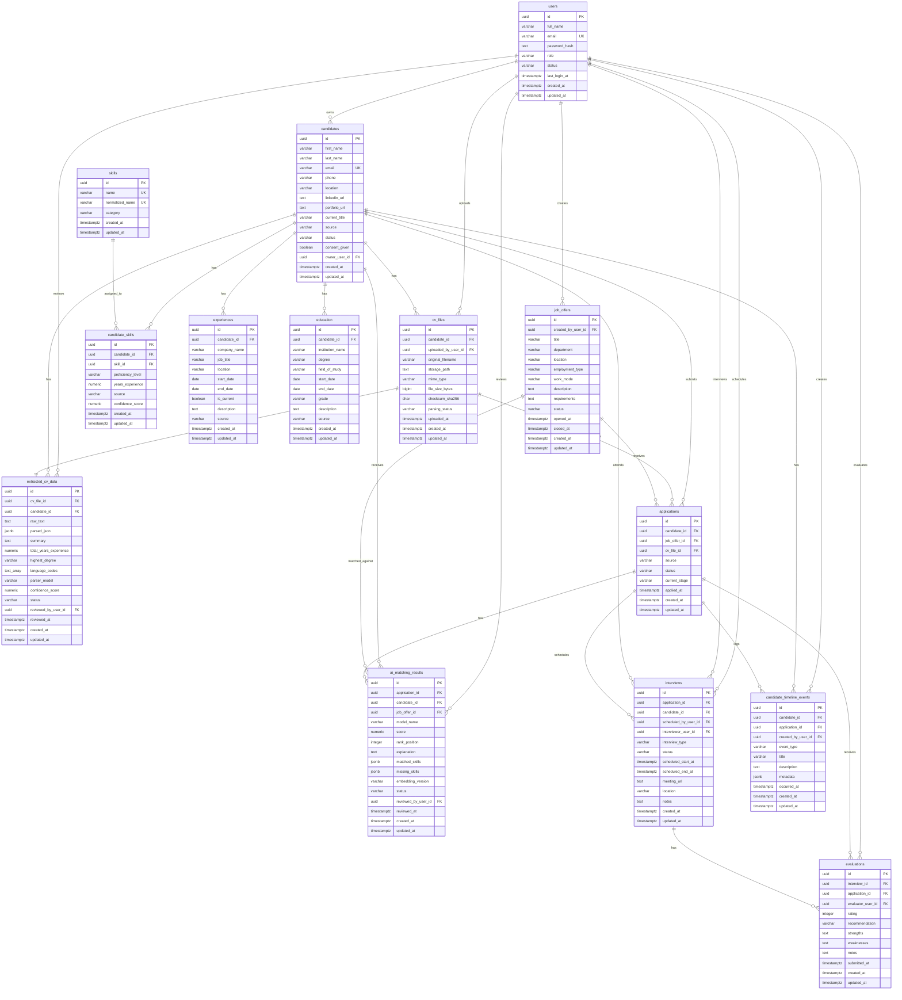

# Database ERD

This document describes the PostgreSQL database design for the Talents Associate AI Recruitment Platform.

## Entity Relationship Diagram

## Table Summary

- `users`: recruiter, admin, and hiring manager authentication records.
- `candidates`: centralized candidate profiles from manual entry, CV upload, LinkedIn CSV, or portal sources.
- `cv_files`: uploaded CV metadata and parsing lifecycle.
- `extracted_cv_data`: AI parser output, raw text, JSON extraction, summary, and review state.
- `skills`: normalized skill catalog.
- `candidate_skills`: many-to-many candidate skill mapping with source and confidence.
- `experiences`: candidate professional history.
- `education`: candidate academic history.
- `job_offers`: open, draft, paused, closed, and archived job offers.
- `applications`: candidate applications to job offers and recruitment stage tracking.
- `ai_matching_results`: semantic match scores, explanations, matched skills, and missing skills.
- `interviews`: scheduled interview rounds and meeting details.
- `evaluations`: interview/application feedback and hiring recommendations.
- `candidate_timeline_events`: CRM timeline for notes, calls, emails, status changes, uploads, interviews, evaluations, and AI events.

## Design Notes

- UUID primary keys are generated with `gen_random_uuid()` from PostgreSQL `pgcrypto`.
- Every core table includes `created_at` and `updated_at`; triggers keep `updated_at` current.
- Status fields use `CHECK` constraints to keep workflow states predictable.
- Foreign keys use cascading deletes for candidate-owned records and `SET NULL` for user audit references.
- JSONB columns support flexible AI parsing and matching outputs.
- Indexes are included for common lookup paths such as candidate status, application status, job status, match score, interview schedule, and CRM timeline date.
